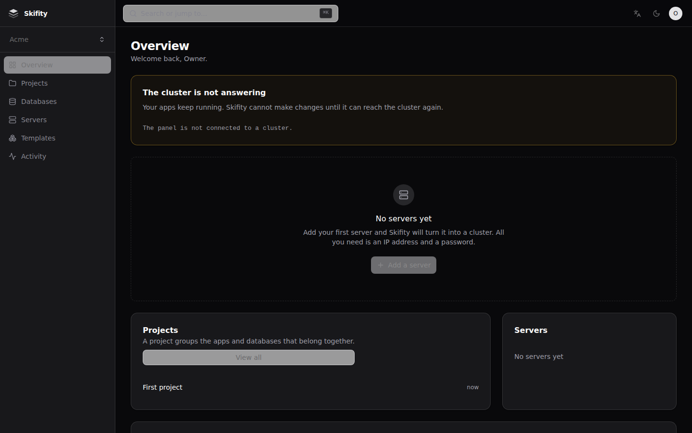
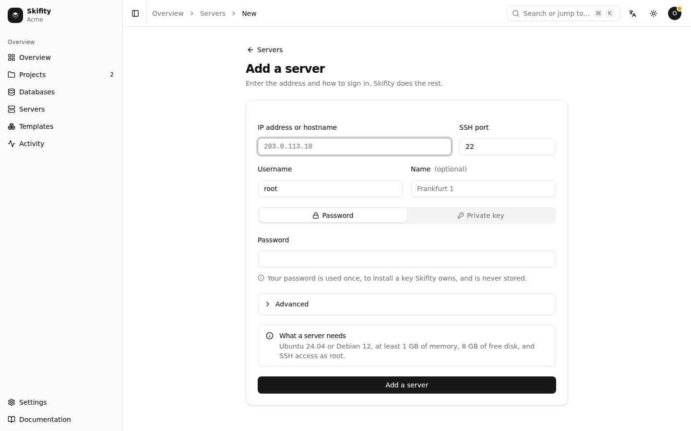
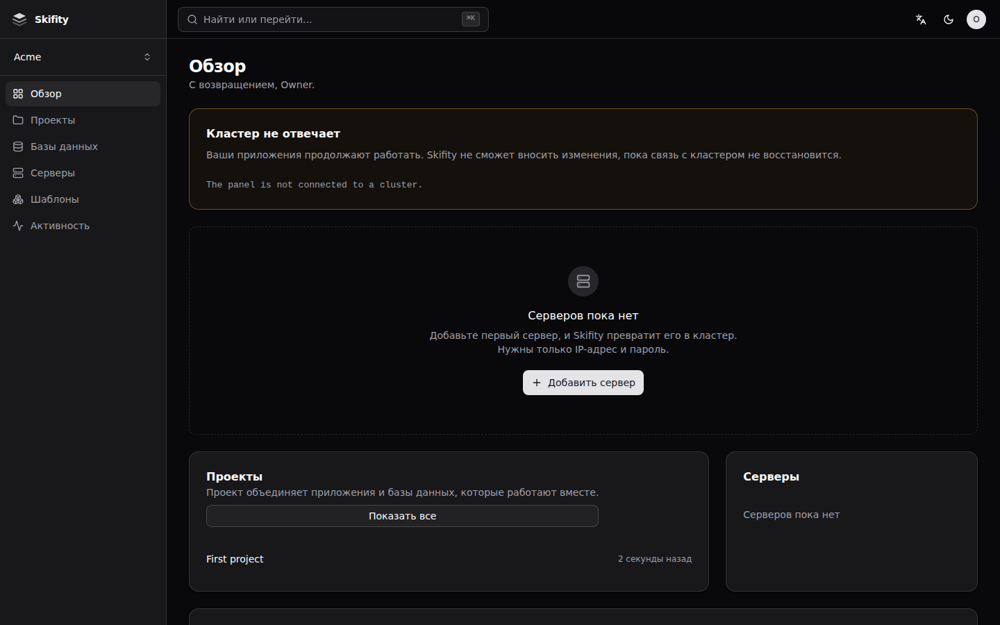

<div align="center">


# Skifity

**Self-hosted apps, powered by Kubernetes.**

You give it a server. It gives you URLs.

</div>

---

```sh
curl -fsSL https://get.skifity.io | sudo sh
```

That is the whole installation. It checks the server, installs Kubernetes,
starts the panel, and prints a URL and a one-time token. Open the URL, create
your account, paste a Git repository, and you have an app on the internet with
HTTPS.

<p align="center">
  
</p>

## What it is

Coolify and Dokploy run Docker Compose on one machine. Skifity runs Kubernetes,
so several servers are one pool: an app that wants three instances gets them
wherever there is room, and an app whose server dies is restarted elsewhere
without anyone being woken up.

What it does not do is make you learn Kubernetes. The panel talks about **Apps**,
**Instances**, **Servers**, **Domains** and **Databases**. The Kubernetes objects
are one click away under **Advanced**, and `kubectl` works normally — they are
simply not in the way.

## Adding a server is an IP address and a password

<p align="center">
  
</p>

Skifity connects, checks the machine, installs a key of its own, configures the
firewall, verifies the network in both directions, installs k3s and joins the
cluster — seven steps, each one shown as it happens.

Your password is used exactly once, to install that key, and is never stored. A
test asserts it: every column of the database is scanned for it.

## What is different about it

**Changing a setting does not rebuild your app.** The single most common
complaint about panels of this kind. Skifity separates what goes into the image
from what the container reads at start-up, so changing a variable is a rollout
in seconds. The panel tells you which kind you are setting before you save, and
says afterwards whether it rebuilt.

**Rolling back restores the settings too**, not just the image. If a variable
broke the app, rolling back puts the old variable back.

**It checks before you scale.** Before running a second instance, Skifity looks
for what would break — SQLite on a local disk, sessions in memory, a cron job
that assumes it is alone — and says what would go wrong and how to fix it.

**Errors are written to be acted on.** Every failure, in the panel, the CLI, the
API and the MCP server, says what happened, what it means and how to fix it,
with a button that copies the whole thing for an AI assistant.

**It never phones home.** No licence key, no telemetry, no update check. It does
not contact any server but yours.

## Built for the terminal and for assistants

One binary is the panel, the CLI and an MCP server.

```sh
skifity deploy                    # deploy this directory
skifity logs --follow             # watch it
skifity env set LOG_LEVEL=debug   # change something, without a rebuild
skifity rollback                  # undo it
```

```sh
claude mcp add skifity -- skifity mcp
```

[`llms.txt`](llms.txt) describes the whole product on one page, and the panel
serves it at `/llms.txt`. See [the CLI guide](docs/cli.md).

## Five languages, properly

<p align="center">
  
</p>

English, Indonesian, Hindi, Russian and Simplified Chinese, all complete. A
build fails if any string is missing from any language, if a plural form a
language needs is absent — Russian needs one, few and many — or if a translation
drops a placeholder. Dates, numbers and relative times are formatted by the
language, not translated around.

## What you need

A server with Ubuntu 24.04 or Debian 12, 1 GB of memory, 8 GB of free disk, and
root over SSH. Any VPS will do. 2 GB is comfortable.

A fresh install is deliberately small: Kubernetes and the panel, and nothing
else. The panel is **34 MiB of resident memory idle**, measured, and does not
drift. Certificates, the builder, the PostgreSQL operator and the rest install
themselves the first time you use them, and each one says what it costs first.

## Documentation

| | |
|---|---|
| [Quick start](docs/quick-start.md) | Empty server to a running app |
| [Concepts](docs/concepts.md) | What the words mean, and what they are underneath |
| [Adding servers](docs/adding-servers.md) | The seven steps, and what to do when one fails |
| [The CLI and AI assistants](docs/cli.md) | Terminal, API, MCP |
| [Troubleshooting](docs/troubleshooting.md) | When something is wrong |
| [Questions](docs/faq.md) | Including the ones with awkward answers |
| [What it costs](docs/performance.md) | Memory and size, measured |
| [Architecture](docs/architecture.md) | How it fits together |
| [Decisions](docs/decisions.md) | Why it is like this |

## Building it yourself

```sh
make build     # the frontend, then one binary with it inside
make check     # every linter, then the tests
make smoke     # end to end against a real panel
```

Go 1.26 and Node 22. `CGO_ENABLED=0` everywhere, so a release binary is static
and runs on anything.

## Status

Honest version: the panel, the CLI, the MCP server and the installer are
complete and tested. What has **not** happened is a run on real hardware — the
environment this was built in refuses privileged containers, so a real k3s
cluster could never be started in it. Everything that needs a cluster is tested
against a fake API server, golden manifests, a real in-process SSH server and
shell syntax checks, and [`docs/progress.md`](docs/progress.md) says exactly
what has and has not been executed.

Treat it as something to try on a spare VPS, not something to move production
onto this afternoon.

## Licence

Apache 2.0. See [LICENSE](LICENSE).
