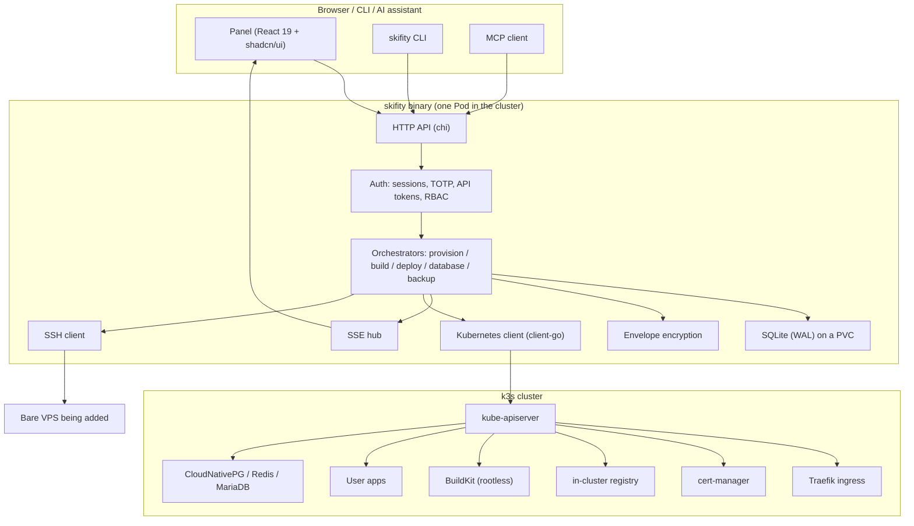
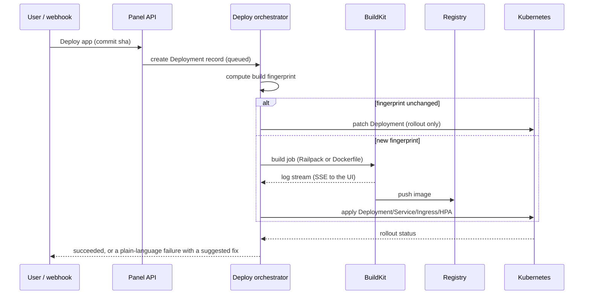
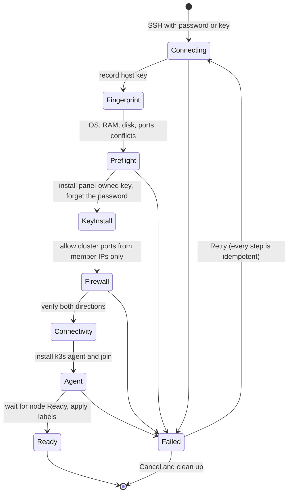
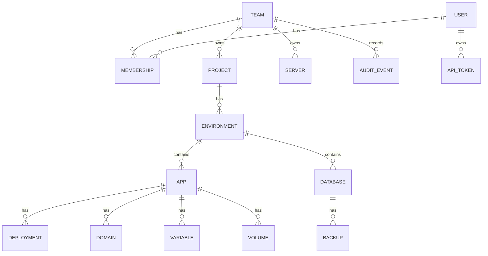

# Skifity architecture

## One sentence

A single Go binary runs inside a k3s cluster, talks to the Kubernetes API for everything that runs,
talks to SSH for everything that turns a bare VPS into a cluster member, and serves an embedded
React panel that never says the word "pod".

## Layers

## Request path of a deploy

## Background work

Anything that takes longer than a request runs in a goroutine of its own: a
deployment, a server being added, a database being provisioned, a backup, a
restore, the health watcher, the minute scheduler, a notification.

Each of them starts with a recover (`internal/runsafe`). A panic is a bug, and a
bug in one deployment must not end the panel — on a self-hosted install the
panel is usually the only way to reach the cluster, so the deployment that
crashed it would also remove the way to find out why. The panic is logged with
its stack, and the one thing it was doing is marked failed, so what a user sees
is a deployment that failed rather than one that is still going and never will
be.

The loops recover per iteration rather than around the loop, because a panel
that is alive with no scheduler is worse than one that restarted: nothing says
so, and the backups simply stop happening.

## Adding a server

## Data model

## Naming: what the user sees vs what Kubernetes sees

| Panel word | Kubernetes object |
|---|---|
| App | Deployment + Service + Ingress |
| Instance | Pod |
| Server | Node |
| Domain | Ingress rule + Certificate |
| Variable / Secret | ConfigMap / Secret |
| Database | CloudNativePG Cluster, or a StatefulSet |
| Environment | Namespace (`<team>-<project>-<env>`) |
| Volume | PersistentVolumeClaim |
| Scaling rule | HorizontalPodAutoscaler |

Kubernetes names appear in the "Advanced" tab of a resource and nowhere else.

## Isolation

Each environment is a namespace carrying a `ResourceQuota`, a `LimitRange` (so a forgotten limit cannot
starve a node), and a default-deny `NetworkPolicy` that permits ingress from Traefik and egress to DNS,
the internet and the environment's own namespace. The panel's ServiceAccount is the only identity with
cluster-wide rights; user-facing tokens are scoped through the panel's own RBAC, never by handing out
kubeconfigs.

## What is installed when

| When | What |
|---|---|
| `install.sh` | k3s server, panel, cert-manager, the panel's PVC and master key |
| First build | in-cluster registry + rootless BuildKit |
| First PostgreSQL | CloudNativePG operator |
| First Redis / MySQL | the matching chart |
| Scale-to-zero enabled | KEDA + http-add-on |
| Cross-node volumes enabled | Longhorn (with a RAM warning) |
| Full monitoring enabled | kube-prometheus-stack (optional; a built-in lightweight view exists without it) |

This is what keeps a fresh install small enough for a 2 GB VPS.
