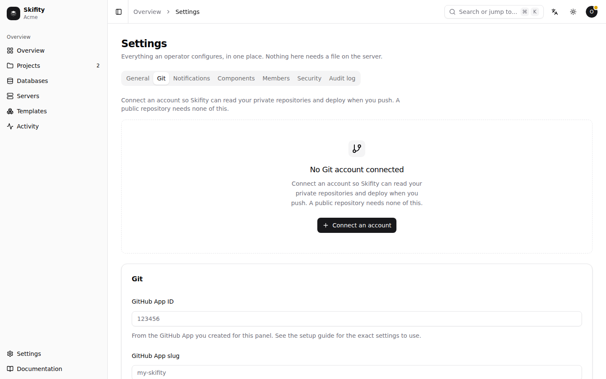

# Configuration

Skifity has two kinds of configuration, and the split is deliberate.

**Settings you change while it is running** — domains, Git accounts, backup
storage, SMTP, the registry — live in the panel's database and are edited under
**Settings**. They are encrypted where they are secret, and changing one takes
effect without a restart.

**Settings that must be known before the database can be opened** — where the
database is, where the master key is, what to listen on — come from the
environment or a file. Those are the only ones on this page's first table.

## Startup configuration

Precedence, lowest to highest: built-in defaults, the configuration file, then
the environment. Every setting has a working default, so an empty configuration
is a valid one.

| Environment variable | Default | What it is |
|---|---|---|
| `SKIFITY_LISTEN` | `:8080` | The address to bind to. `127.0.0.1:8080` keeps it off the network behind a reverse proxy. |
| `SKIFITY_DATABASE_PATH` | `/var/lib/skifity/panel.db` | The SQLite file holding everything except the master key. |
| `SKIFITY_MASTER_KEY_PATH` | `/etc/skifity/master.key` | The key every stored secret is encrypted with. Back this up. |
| `SKIFITY_SETUP_TOKEN_PATH` | `/etc/skifity/setup-token` | The one-time token that allows the first account. Deleted once setup is done. |
| `SKIFITY_PUBLIC_URL` | derived from the request | How people reach the panel. Used for webhook URLs and links in notifications. |
| `SKIFITY_KUBECONFIG` | empty | Empty when running inside the cluster: the ServiceAccount is used instead. |
| `SKIFITY_NAMESPACE` | `skifity-system` | The namespace the panel itself runs in. |
| `SKIFITY_LOG_LEVEL` | `info` | `debug`, `info`, `warn` or `error`. |
| `SKIFITY_LOG_FORMAT` | `json` | `json` or `text`. |
| `SKIFITY_TRUSTED_PROXY_COUNT` | `1` | How many reverse proxies sit in front. Only that many entries are trusted from `X-Forwarded-For`, so a client cannot forge its own address. |
| `SKIFITY_SESSION_TTL` | `168h` | How long a sign-in lasts without activity. |
| `SKIFITY_SHUTDOWN_GRACE` | `20s` | How long in-flight requests get when stopping. |
| `SKIFITY_DEV_MODE` | `false` | Serves the interface from a Vite dev server and relaxes cookie security. Development only. |
| `SKIFITY_DEV_FRONTEND_URL` | `http://127.0.0.1:5173` | Where that dev server is. |

`.env.example` in the repository is the same list, with comments.

A configuration file may be passed with `--config`, in a simple `key = value`
format. Its keys are the variable names without the prefix, lower-cased:

```toml
listen = ":8080"
log_level = "debug"
database_path = "/var/lib/skifity/panel.db"
```

## Settings in the panel



These are stored encrypted where they are secret, and none of them is required
to get started.

| Group | What it is for |
|---|---|
| **General** | The panel's own URL, the default builder, and an explicit switch for usage reporting — which is off, and has always been off, and exists so that its absence is visible rather than assumed. |
| **Domains and HTTPS** | A wildcard domain so every app gets a free subdomain, the address domains should point at, and the email Let's Encrypt sends expiry warnings to. |
| **Git** | A GitHub App, for organisations that would rather not use a personal token. Personal tokens for GitHub, GitLab and Gitea are added under Settings → Git without anything here. |
| **Backup storage** | S3 or anything that speaks S3, including MinIO. Credentials never leave the panel: a backup Job is handed a presigned URL that expires. |
| **DNS** | A provider token, for wildcard certificates, which need a DNS challenge. |
| **Email** | SMTP, for notifications. |
| **Image registry** | Where built images go. An in-cluster registry is installed on first use if this is left empty. |

## The CLI

The CLI keeps its own configuration in your user configuration directory, so a
token cannot be committed to a repository by accident.

| Environment variable | What it is |
|---|---|
| `SKIFITY_URL` | The panel's address. |
| `SKIFITY_TOKEN` | An API token, created under **Account → API tokens**. |
| `SKIFITY_TEAM` | Only needed when your account is in more than one team. |
| `SKIFITY_CONFIG` | A different path for the stored configuration. |

With `SKIFITY_URL` and `SKIFITY_TOKEN` set, nothing has to be signed in first,
which is how the CLI and the MCP server are meant to be used from CI, a
container or an assistant's sandbox. They override anything stored.

## What to back up

Two things, and they are not the same thing:

1. `/etc/skifity/master.key` — without it every stored secret and every database
   backup is unreadable. The panel can also print a recovery key that encodes
   the same secret in a form you can write on paper.
2. `/var/lib/skifity/panel.db` — the panel's own state: teams, apps, settings
   and history. Your applications' data is in their volumes and databases, and
   is backed up separately by the panel itself.

   Take this copy with `skifity admin backup-db <path>` rather than copying the
   file. The database runs in WAL mode, so a committed change can still be in
   `panel.db-wal` and not yet in `panel.db`; a plain copy loses it and says
   nothing. The command goes through SQLite, works while the panel is running,
   and writes one file.

Keep the key somewhere the database backup is not. Together they are everything;
apart, neither is enough.

## Monitoring the panel

The panel watches the cluster; this is how you watch the panel. `GET
/api/metrics` returns the Prometheus text format.

It is behind the same authentication as the rest of the API, because it says how
many apps and servers exist and how the process is getting on, which is not
something to hand to anyone who can reach the port. Scrape it with an API token
from an account with administrator rights:

```yaml
scrape_configs:
  - job_name: skifity
    metrics_path: /api/metrics
    authorization:
      credentials: skf_your_token_here
    static_configs:
      - targets: ["panel.example.com"]
```

Create the token under your account, then **API tokens**.

What is there:

| Metric | What it tells you |
| --- | --- |
| `skifity_http_requests_total` | Requests by method, route and status. The route is the pattern, not the path, so an id never becomes a label. |
| `skifity_http_request_duration_seconds` | A histogram of how long they took. |
| `skifity_deployments_total` | Deployments that finished, by result. |
| `skifity_deployments_in_flight` | Deployments that have not. A number that only climbs means something is stuck. |
| `skifity_apps`, `skifity_servers` | How many exist; servers are split by status. |
| `skifity_cluster_reachable` | 1 when the Kubernetes API answered. |
| `skifity_event_clients` | Open event streams. Climbing and never falling is a subscription that is not being closed. |
| `skifity_database_bytes` | The size of `panel.db`. |
| `skifity_goroutines`, `skifity_memory_heap_bytes` | The two numbers that say the panel is leaking. |
| `skifity_uptime_seconds`, `skifity_build_info` | How long it has been up, and which version. |

Three alerts are worth having: `skifity_cluster_reachable == 0` for more than a
few minutes, `skifity_deployments_in_flight` above zero for an hour, and
`skifity_goroutines` climbing steadily over a day.
