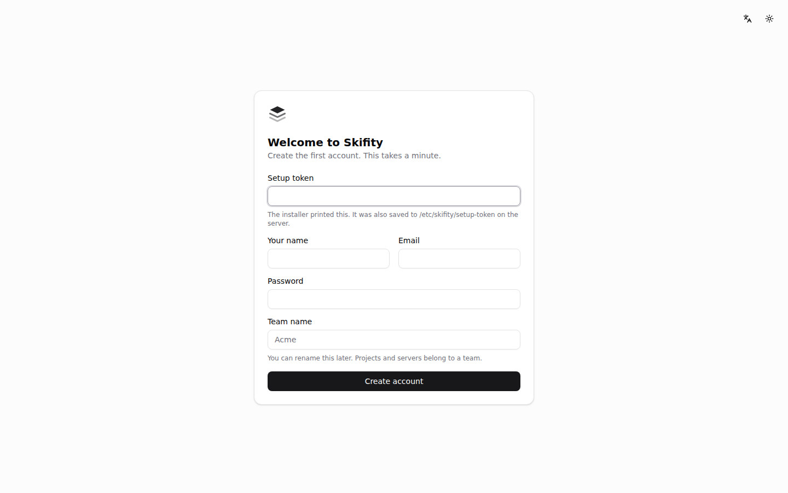
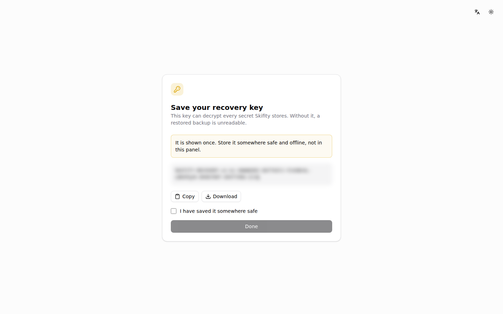
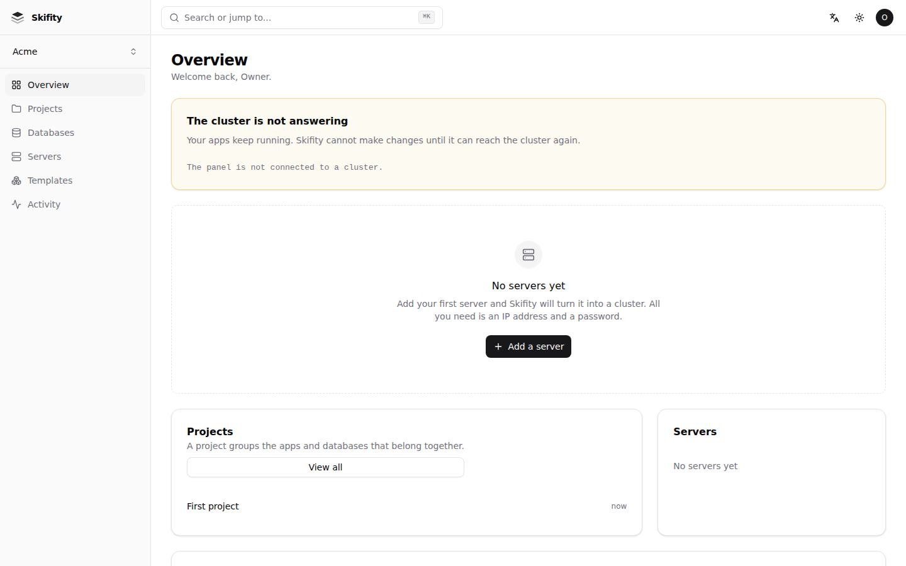

# Quick start

From an empty server to an app on the internet. About ten minutes, most of it
waiting for things to download.

## What you need

* A server running Ubuntu 24.04 or Debian 12, with at least 1 GB of memory and
  8 GB of free disk, and root access over SSH. Any VPS will do.
* Optionally, a domain name. Skifity works without one.

## 1. Install

SSH into the server and run:

```sh
curl -fsSL https://get.skifity.io | sudo sh
```

If you already have a domain pointed at the server, tell the installer and it
sets up HTTPS at the same time:

```sh
curl -fsSL https://get.skifity.io | sudo SKIFITY_DOMAIN=panel.example.com sh
```

It checks the server first, installs Kubernetes, starts the panel, and finishes
by printing two things: a URL and a setup token. Keep them.

If it stops, it says what happened and what to do about it. The full log is at
`/var/log/skifity-install.log`, and running the installer again is safe.

## 2. Create your account



Open the URL. Paste the setup token, choose an email address and a password,
and name your team.



You are then shown a **recovery key**. It is the only copy: it can decrypt every
secret Skifity stores, and without it a restored backup is unreadable. Download
it and put it somewhere that is not this server. The panel will keep reminding
you until you say you have.



## 3. Deploy something

Press **New app**, paste a Git repository URL, and press Create.

That is the whole form. Skifity works out how to build it, gives it a URL, and
sets `PORT` for it to listen on. The deployment page shows the build as it
happens.

When it finishes, the app has a working address with HTTPS. Press it.

## 4. Add your own domain

Open the app, go to **Domains**, and add yours. The panel shows the DNS record
to create. Once it resolves, the certificate is issued automatically and the
domain goes green.

Your app keeps its original address too, so nothing breaks while DNS
propagates.

## 5. Add a second server

One server is fine to start. When you want more capacity, or you want the
cluster to survive a failure, go to **Servers** and press **Add a server**.

Enter its IP address and how to sign in. Skifity does the rest: it checks the
server, installs a key of its own, configures the firewall, joins the server to
the cluster, and starts placing instances on it. The password you type is used
once and never stored.

Three control plane servers is the point at which losing one changes nothing.

## What next

* [Concepts](concepts.md) — what Skifity means by a project, an app and an
  instance, and what each one is underneath.
* [Adding servers](adding-servers.md) — what the seven steps do, and what to do
  when one fails.
* [The CLI and AI assistants](cli.md) — deploying from a terminal, and letting
  an assistant do it.
* [Troubleshooting](troubleshooting.md) — when something is wrong.
